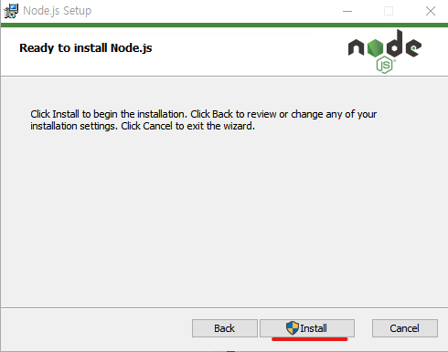
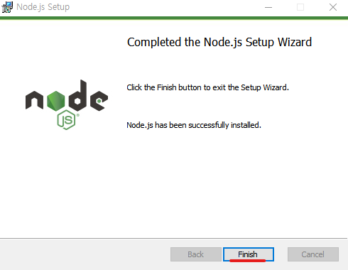

 
    <a href="../README.md">[INDEX]</a>

# Node.js 설치

### 1. Node.js 공식사이트 
> https://nodejs.org/ko

### 2. Node.js 다운로드
> https://nodejs.org/ko/download
> - 최신버전은 v24.0.2 (Current) 버전이나, 
> - 안정적인 개발을 위해 `LTS(Long Term Support)` 장기지원버전 설치하기를 추천  
cf. 추천버전은 3년동안 안정적으로 사용할 수 있음.

### 3. Node.js 설치
> node-v22.14.0-arm64.msi 클릭

##### (1) node-v22.14.0-arm64.msi 실행, `Next` 클릭

##### (2) 라이센스 동의 체크 후 `Next` 클릭 

##### (3) 설치 파일경로 선택 후 `Next` 클릭 (기본으로 설정)

##### (4) Custome Setup 단계 `Next` 클릭 

##### (5) Tools for Native Modules 체크 후 `Next` 클릭 

##### (6) 설치 준비 완료, `Install` 클릭 

##### (7) 설치 성공 완료, `Finish` 클릭 

### 4. Node.js 실행 체크
> PowerShell에서 버전 체크

