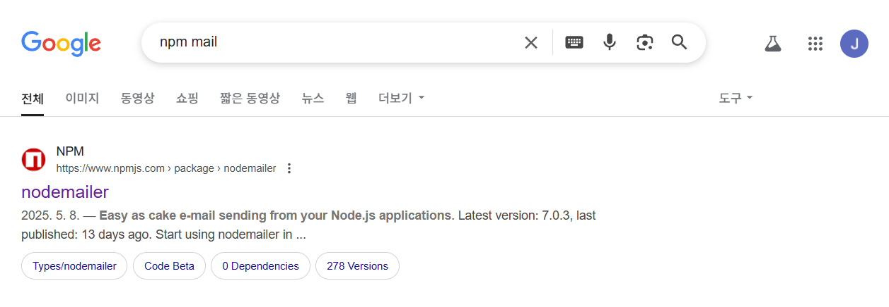
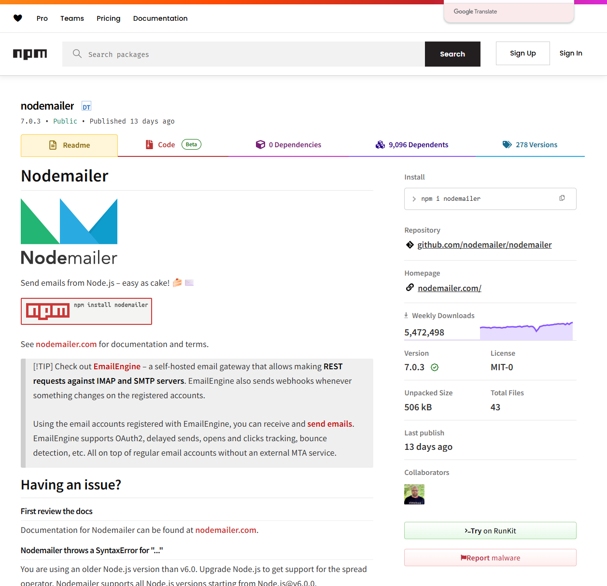
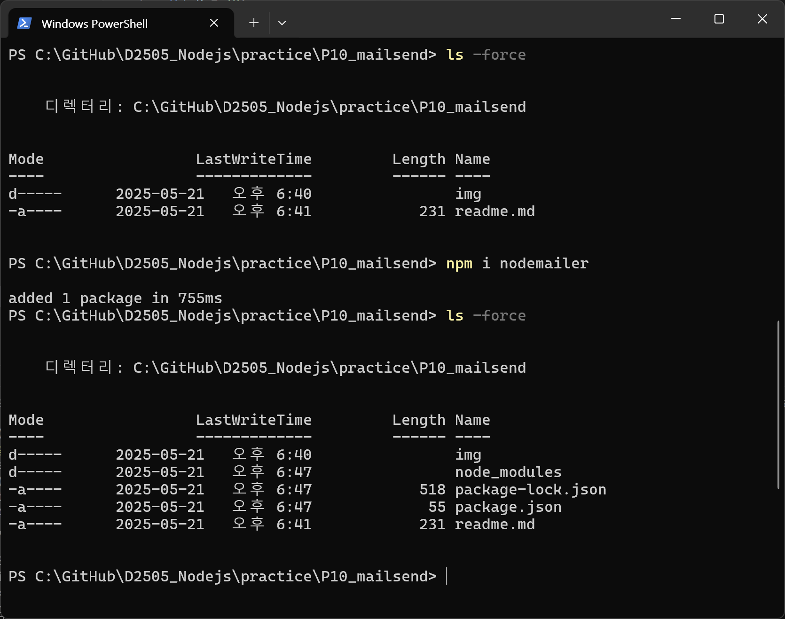
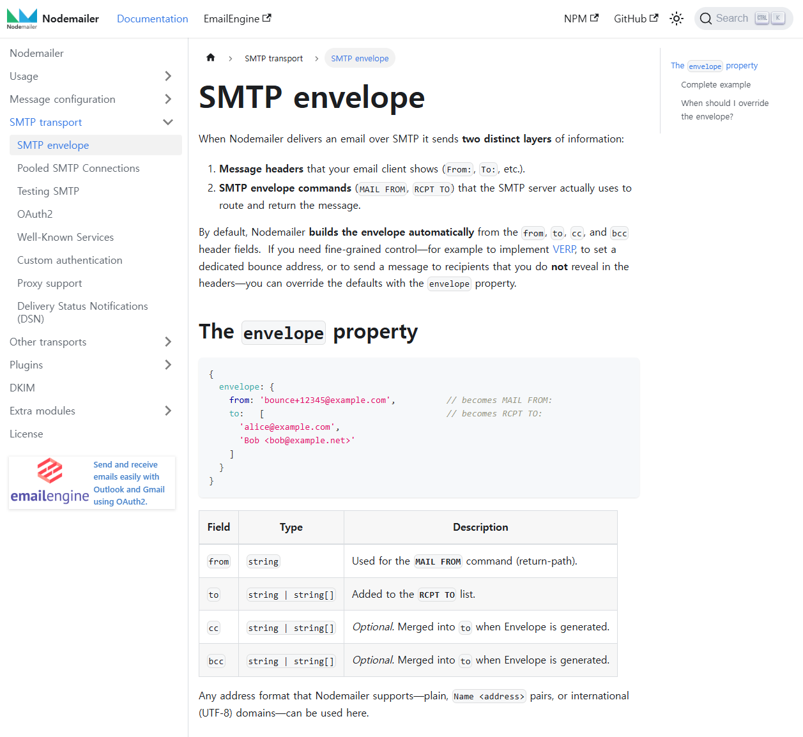
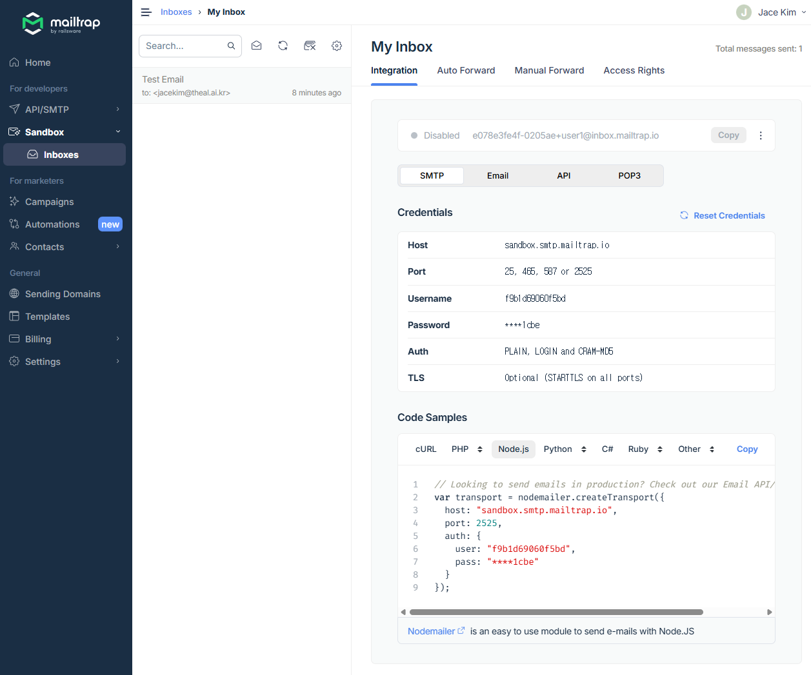
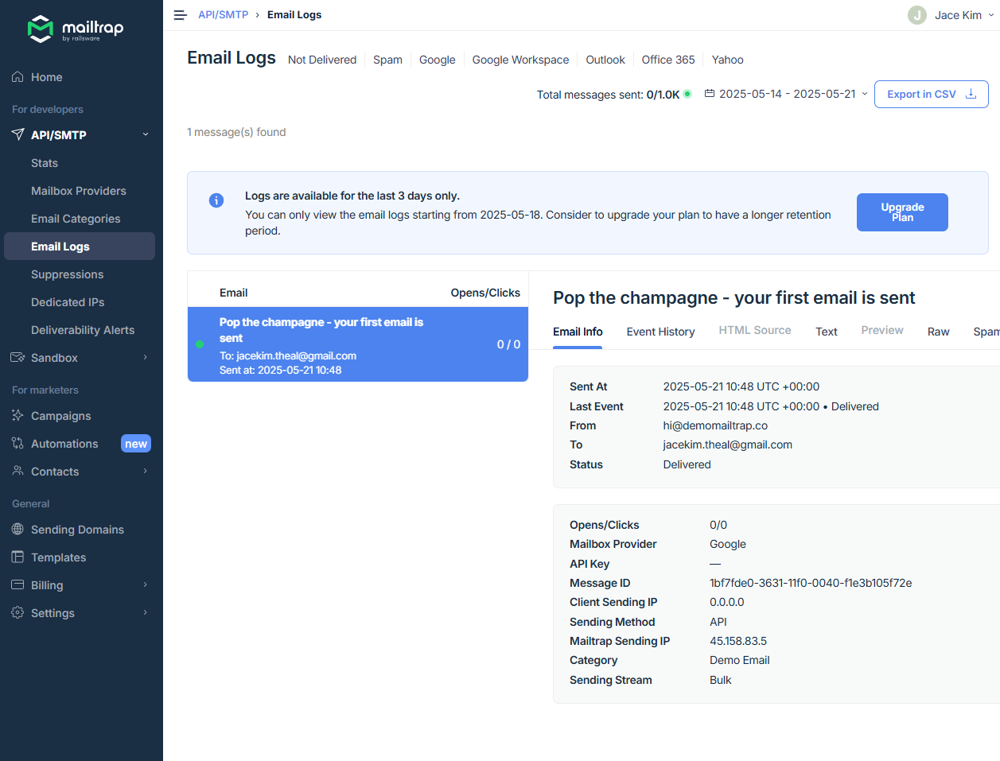

# 간단한 메일보내기 구현

### 개발환경
> 메일전송에 필요한 패키지(Nodemailer) 설치 및 메일전송 플랫폼(Mailtrap.io) 등록

- 구글에서 `npm mail` 이라고 검색


- **Nodemailer** 패키지 설치


```
> npm i nodemailer
```


> [package.json]
```json
{
  "dependencies": {
    "nodemailer": "^7.0.3"
  }
}
```


> SMTP envelope


- Mialtrap 
> Home : https://mailtrap.io/ <br/>
> - 개발자와 마케터를 위한 이메일 테스트 및 전송 플랫폼입니다. <br/>
> - 이메일을 실제로 발송하지 않고 가상의 환경에서 테스트할 수 있어, 개발 단계에서 안전하게 이메일을 검증할 수 있습니다. <br/>

> 주요 기능
> - 이메일 샌드박스: 테스트 환경에서 이메일을 가로채고 미리보기 가능.
> - SMTP 및 API 지원: 다양한 이메일 서비스와 연동 가능.
> - 스팸 및 HTML 검사: 이메일이 스팸으로 분류될 가능성을 분석하고 HTML을 검증.
> - 마케팅 이메일 전송: 대량 이메일 및 캠페인 관리 기능 제공.



---
### 코드구현
- [sendmail.js]
```javascript
const nodemailer = require('nodemailer');
const email = {
    host: "sandbox.smtp.mailtrap.io",
    port: 2525,
    auth: {
        user: "f9b1d69060f5bd",
        pass: "6f50d5cd8c1cbe"
    }
};

const send =async (option) => {
    nodemailer.createTransport(email).sendMail(option, (err, info) => {
        if (err) {
            console.log('Error occurred while sending email:', err);
        } else {
            console.log('Email sent successfully:', info.response);
        }
    });
};

let email_data = {
    from: 'jacekim.theal@gmail.com',
    to: 'jacekim@theal.ai.kr',
    subject: 'Test Email',
    text: 'This is a test email sent using Node.js and Nodemailer.',
    html: '<h1>This is a test email sent using Node.js and Nodemailer.</h1>'
};

send(email_data);

```

- 실행
```powershell
PS C:\GitHub\D2505_Nodejs\practice\P10_mailsend> node .\sendmail.js
Email sent successfully: 250 2.0.0 Ok: queued
PS C:\GitHub\D2505_Nodejs\practice\P10_mailsend>
```

- 메일전송확인



