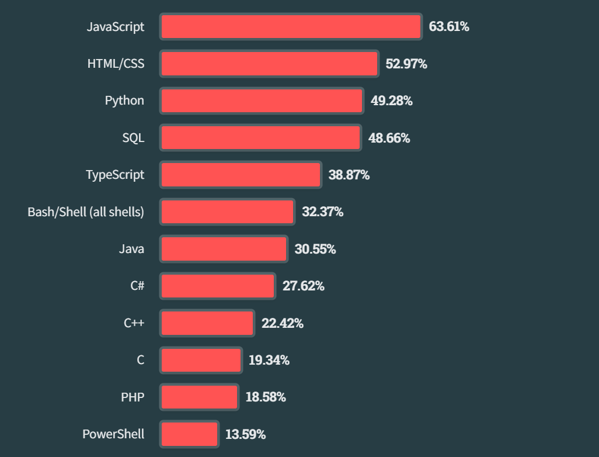
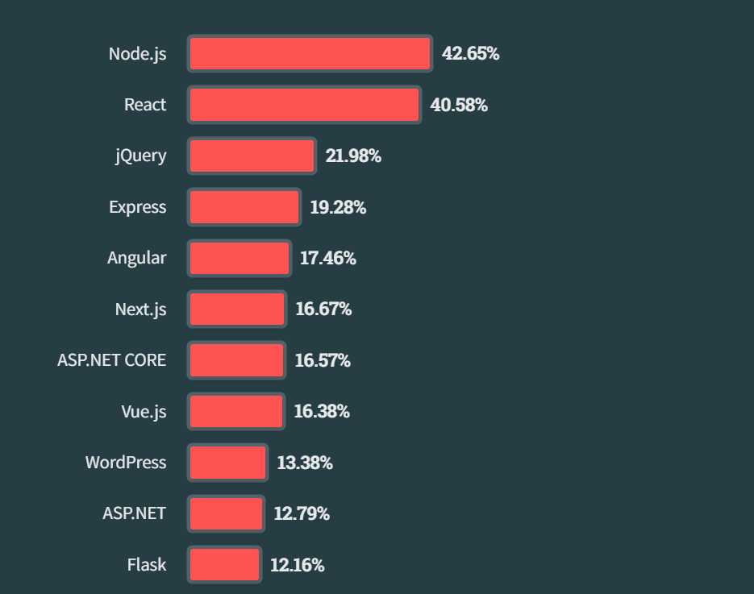
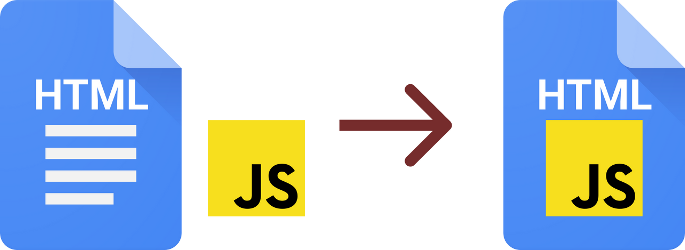
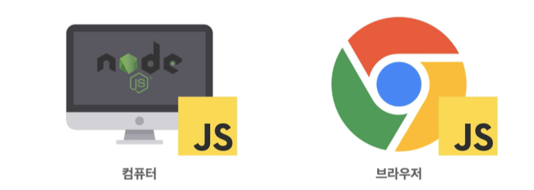
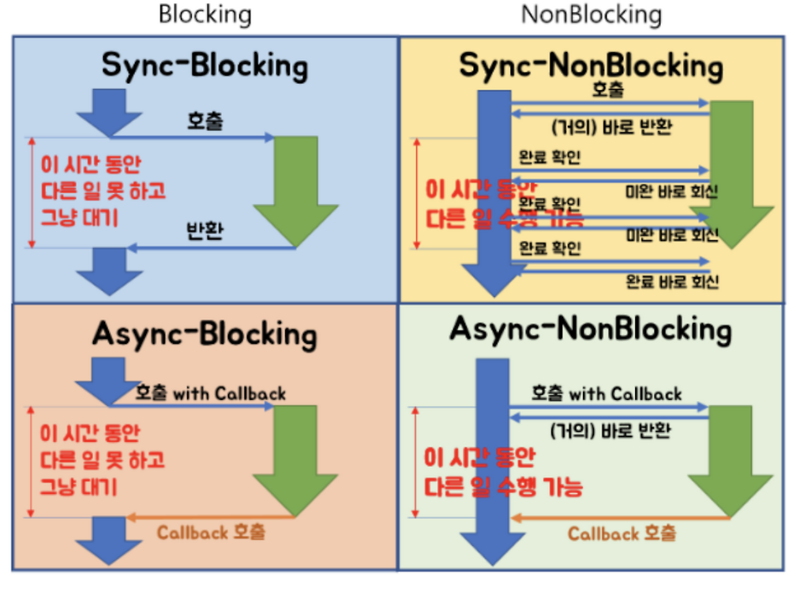
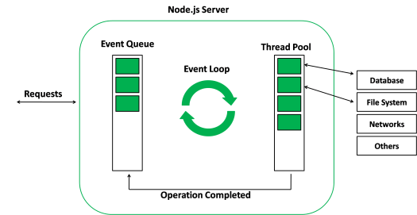

# Node.js ?
> 크로스플랫폼 오픈소스 자바스크립트 런타임 환경으로 V8 자바스크립트 엔진으로 구동되며, 웹 브라우저 바깥에서 자바스크립트 코드를 실행할 수 있다.  
> 주로 확장성 있는 네트워크 애플리케이션과 서버 사이드 개발에 사용되는 소프트웨어 플랫폼이며, 논블로킹(Non-blocking) I/O와 단일 스레드 이벤트 루프를 통한 높은 처리 성능을 가지고 있다.

[Fig. 2023 Stackoverflow 점유률](https://en.wikipedia.org/wiki/Node.js)

---
### 위키백과에서 가져온 Node.js 설명
1. Node.js는 V8이라는 JavaScript 엔진으로 구동되는 자바스크립트 런타임(환경)이다.
2. Node.js를 사용하면 웹 브라우저 바깥에서 자바스크립트 코드를 실행할 수 있다.
3. Node.js는 크로스 플랫폼 오픈소스로 모든 운영체제에서 동작할 수 있다.
4. Node.js를 사용하여 확장성 있는 네트워크 애플리케이션과 서버 사이드 개발에 사용된다.
5. 논블로킹(Non-bloking) I/O와 단일 스레드 이벤트 루프를 통한 높은 처리 성능을 가지고 있다.

---

#### 1. Node.js는 V8이라는 JavaScript 엔진으로 구동되는 자바스크립트 런타임(환경)이다.

- 이 문구를 이해하기 위해서는 자바스크립트가 어떻게 동작하는지 먼저 알아야 합니다. 자바스크립트(JavaScript)는 동적인 웹 페이지를 만들어주기 위해 사용되던 스크립트 언어입니다. 엄연한 프로그래밍 언어이기 때문에 누군가가 컴퓨터가 이해할 수 있도록 바꿔줘야 합니다. 그렇다면 이 역할을 누가 했을까요?
- 바로 브라우저입니다. 정확히는 브라우저에 내장되어 있던 자바스크립트 엔진이죠. 여기서 V8이 등장합니다. V8은 구글이 개발한 오픈 소스 자바스크립트 엔진입니다. 당시 크롬에 탑재했었죠. 이 V8 엔진은 자바스크립트 코드를 실행하는데 매우 빠르고 효율적으로 설계되어 있었습니다.
- 그래서 사람들은 생각하게 됩니다. 자바스크립트를 꼭 프론트엔드에서만 사용해야 할까? 그래서 이 V8엔진을 브라우저 밖으로 끌고 나오게 됩니다. 그리고 이 V8엔진을 기반으로 Node.js를 만들죠. 자바스크립트를 작성하고 V8엔진으로 실행하고 즉 새로운 런타임(환경)이 탄생한 것입니다.
 
 

#### 2. Node.js를 사용하면 웹 브라우저 바깥에서 자바스크립트 코드를 실행할 수 있다.

- 즉 Node.js를 사용하면 웹 브라우저 바깥에서 자바스크립트 코드를 실행할 수 있습니다.  
이제 브라우저가 아닌 Node.js가 설치되어 있는 컴퓨터에서도 자바스크립트 실행이 가능해진 거죠.  
컴퓨터에 설치되어 있는 Node.js에 의해 자바스크립트를 실행할 수 있는 환경이 제공된 것입니다.
 
 

#### 3. Node.js는 크로스 플랫폼 오픈소스로 모든 운영체제에서 동작할 수 있다.
- 이 부분도 바로 이해가 가능합니다. Node.js가 크로스 플랫폼을 지원하는 주요 이유 중 하나는 설치형 프로그램이기 때문입니다. 직접 설치를 해보셨다면 아시겠지만 Node.js는 각 운영 체제에 맞는 실행 파일을 제공하고, 이를 통해 자바스크립트 런타임 환경을 설치할 수 있도록 합니다.
- 그리하여 node.js는 크로스 플랫폼 오픈 소스 런타임 환경으로, Windows, macOS, Linux 등의 다양한 운영 체제에서 사용할 수 있습니다. 또한 NPM을 통해 다양한 운영 체제에서 작동하는 패키지를 관리하고 수많은 라이브러리와 도구를 쉽게 설치하고 사용할 수 있습니다.
 
 

#### 4. Node.js를 사용하여 확장성 있는 네트워크 애플리케이션과 서버 사이드 개발에 사용된다.
> 여기서 주목할 점은 서버 사이드 개발입니다. 실제로 Node.js를 사용해서 서버사이드 개발을 진행하는 기업들이 많아졌습니다. 이점이 많기 때문입니다. 그렇다면 어떠한 이점이 있을까요?

- **풀 스택 자바스크립트** : Node.js를 사용하면 프론트엔드와 백엔드 모두 자바스크립트로 작성할 수 있습니다. 이는 개발자들이 한 가지 언어만으로 전체 개발을 끝낼 수 있다는 말이 됩니다. 아무래도 효율적이겠죠. 클라이언트와 서버 간의 코드를 재사용할 수도 있고, 하나의 언어로 전체 개발이 가능해져 일관된 개발 환경을 제공할 수도 있습니다.
- **광범위한 패키지 생태계** : NPM(Node Package Manager)을 통해 수많은 오픈 소스 라이브러리와 모듈을 사용할 수 있어서 개발 시간을 단축하고 기능을 확장할 수 있습니다. 많은 사용자들이 구성해 놓은 커뮤니티의 풍부한 자료 덕분에 개발과 예기치 못한 문제 해결에 용이합니다.
- **높은 성능** : Node.js를 사용하여 서버를 구성하면 좋은 이유 중 하나가 바로 높은 성능입니다. 기본적으로 Node.js는 비동기 I/O와 이벤트 구동 모델 덕분에 많은 동시 접속자를 효율적으로 처리할 수 있습니다. 요즘 서비스들은 많은 트래픽들을 동반하는 경우가 많습니다. 이때 Node.js는 최상의 효율을 발휘합니다. 이 부분은 다음에서 자세히 설명하겠습니다.
 
 

#### 5. 논블로킹(Non-bloking) I/O와 단일 스레드 이벤트 루프를 통한 높은 처리 성능을 가지고 있다.

> 기본적으로 node.js는 모든 이벤트를 비동기처리합니다. 즉 논블로킹 I/O 네트워크 요청이 백그라운드에서 항상 비동기적으로 처리되어 다른 작업을 차단하지 않고 실행할 수 있도록 한다는 뜻입니다. 그래서 요청을 보내고 결과를 기다리는 동안 다른 코드가 계속 실행될 수 있음을 의미하고, 이는 여러 요청을 동시에 처리할 수 있기 때문에 요청이 많은 환경에서 서버의 과부하를 줄여주고 뛰어난 성능을 발휘할 수 있겠습니다.
 
 

> Node.js는 단일 스레드 이벤트 루프를 사용하여 작업을 처리합니다. 즉 하나의 스레드에서 처리하고, 이벤트 루프를 통해 비동기적으로 작업을 조절합니다. 이벤트 루프(event loop)의 뜻은 여러 이벤트가 동시에 발생했을 때 어떤 순서로 콜백함수를 호출할지를 판단하는 것을 의미하며 노드는 이벤트가 종료될 때까지 이벤트 처리를 위한 작업을 반복하므로 루프(loog)라고 부릅니다.
 
 

---
#### Node.js 단점
- 이벤트 기반 비동기 방식이기에 서버단 로직이 복잡한 경우 콜백함수의 늪에 빠질 수 있습니다.
- 코드를 순차적으로 실행하지 않고 모두 비동기 방식으로 이벤트를 보내기 때문에 이로 인한 논리적 오류가 발생할 수 있겠습니다.
- 단일 스레드이기 때문에 하나의 요청 중에서 에러가 발생하면 전체 서버에 영향이 갈 수 있습니다. 그래서 작업 자체가 많이 걸리는 웹서비스에는 어울리지 않습니다.
- 자바스크립트로 이루어졌기 때문에 코드가 수행되어야 코드에 에러가 있는지 알 수 있습니다.

